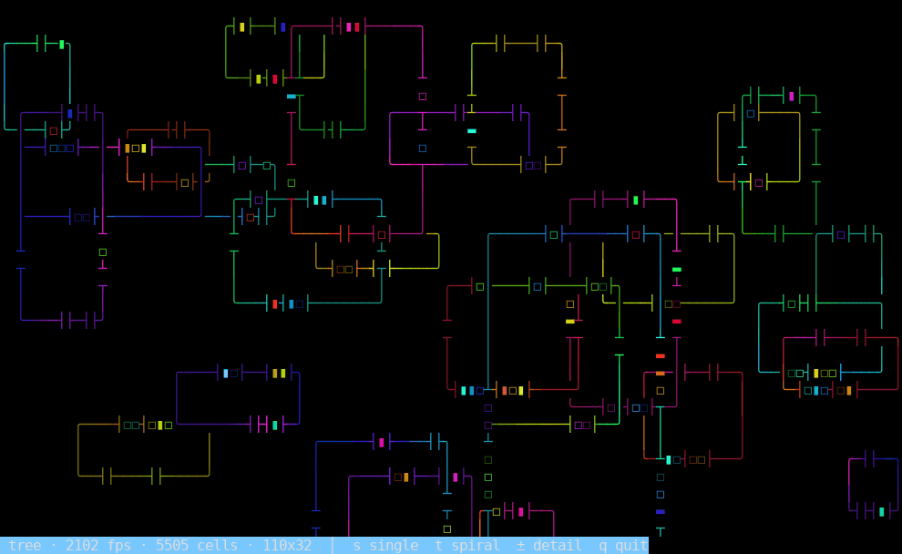

# aerie

Real-time process-group performance monitor for Linux.

`aerie` reads `/proc` and groups processes by name, cgroup, or executable,
displaying a dual-metric bar chart updated every 2 seconds. It supports local
monitoring, SSH fleet fan-out, Proxmox VE API polling, and Kubernetes pod
drill-down.

Press `m` for the full built-in manual, or `aerie -m | less` from the shell.

## Features

- **Dual-metric bar chart** — two metrics side by side per group; cycle with `←`/`→`
- **17 metrics** — CPU%, memory, disk read/write, page faults, context switches,
  open FDs, swap, scheduler wait, estimated power (RAPL), CFS throttle, PSI
  pressure (cpu/mem/io), GPU%, VRAM
- **Three grouping modes** — by process name (`comm`), cgroup, or executable path; cycle with `g`
- **GPU support** (`--enable-gpu`) — per-process GPU engine % and VRAM via
  `/proc/PID/fdinfo` (Intel i915/xe, AMD amdgpu, kernel ≥ 5.14); NVIDIA via
  `nvidia-smi` pmon; multi-GPU with per-device selection using `[`/`]`
- **Fleet mode** (`--hosts`, `--enable-remote`) — monitor many SSH hosts in one view;
  press Enter to drill into any host
- **Thin probe** (`--thin`) — CPU% + memory without aerie installed on the remote;
  works over any SSH connection via a `/proc` shell one-liner
- **Proxmox VE** (`--proxmox`) — poll the PVE REST API; group VMs by pool, tag, or
  node; press Enter to SSH into any VM and monitor its processes live
- **Kubernetes** (`--kube`, experimental) — discover pods via `kubectl`, fan out
  metrics, drill into any pod with `kubectl exec`
- **Replay / scrub** — `p` to pause, `←`/`→` to scrub through buffered history
  (default 4 minutes at 2 s interval)
- **Latency scope** (`d`) — built-in cyclictest that finds *system-wide* scheduling
  jitter, the recurring stall that stutters TUIs, video, and audio alike; periodicity
  analysis + ranked culprit attribution, with optional capture log (`--scope-log`)
- **Anomaly detection** — load-concentration alerts with optional shell hook
  (`--alert-cmd`)
- **Built-in manual** — `m` in the TUI or `aerie -m` at the shell

## Installation

### Pre-built packages

Download from [GitHub Releases](https://github.com/perpetualbits/aerie/releases/latest):

| Architecture | Binary | Debian/Ubuntu | Fedora/RHEL | Snap |
|---|---|---|---|---|
| x86-64 | `aerie-vX.Y.Z-x86_64-linux` | `aerie_X.Y.Z_amd64.deb` | `aerie-X.Y.Z.x86_64.rpm` | `aerie_X.Y.Z_amd64.snap` |
| aarch64 | `aerie-vX.Y.Z-aarch64-linux` | `aerie_X.Y.Z_arm64.deb` | `aerie-X.Y.Z.aarch64.rpm` | — |
| riscv64 | `aerie-vX.Y.Z-riscv64-linux` | `aerie_X.Y.Z_riscv64.deb` | `aerie-X.Y.Z.riscv64gc.rpm` | — |

```bash
# Debian/Ubuntu
sudo dpkg -i aerie_*.deb

# Fedora/RHEL
sudo rpm -i aerie-*.rpm

# Raw binary
chmod +x aerie-*-linux && sudo mv aerie-*-linux /usr/local/bin/aerie
```

### Build from source

Requires Rust 1.85+:

```bash
git clone https://github.com/perpetualbits/aerie
cd aerie
cargo build --release
sudo cp target/release/aerie /usr/local/bin/
```

## Quick start

```bash
# Local process monitor
aerie

# Show only the 20 busiest groups, refresh every second
aerie -n 20 -i 1

# Enable GPU metrics (Intel/AMD via fdinfo, NVIDIA via nvidia-smi)
aerie --enable-gpu

# Monitor a Proxmox cluster
aerie --proxmox https://pve.lan:8006 --token user@pam!mytoken=SECRET

# Monitor a fleet of SSH hosts
aerie --enable-remote --hosts web1,web2,web3

# Monitor fleet from a file, use thin probe (no aerie needed on remotes)
aerie --enable-remote --hosts @/etc/aerie/hosts --thin

# Monitor Kubernetes pods in a namespace
aerie --kube monitoring

# Print the built-in manual
aerie -m | less
```

## Key bindings

| Key | Action |
|---|---|
| `←` / `→` | Cycle left / right metric |
| `Tab` | Switch active metric side |
| `↑` / `↓` or `j` / `k` | Move cursor |
| `g` | Cycle grouping: comm → cgroup → exe |
| `s` | Cycle sort order |
| `h` | Toggle log scale |
| `r` | Force immediate refresh |
| `p` | Pause / resume (frozen display) |
| `[` / `]` | Cycle GPU device (with `--enable-gpu`) |
| `d` | Toggle latency scope (diagnostics) |
| `Enter` | Drill into VM / host / pod |
| `Esc` | Return to group list |
| `m` | Toggle built-in manual |
| `q` | Quit |

## CLI reference

```
aerie [OPTIONS]

Options:
  -i, --interval <SECS>       Refresh interval (default: 2)
  -n, --top <N>               Show only top-N busiest groups (0 = all)
  -m, --manual                Print built-in manual and exit
  -V, --version               Print version

Proxmox:
      --proxmox <URL>         Proxmox API base URL (e.g. https://pve.lan:8006)
      --token <TOKEN>         API token (USER@REALM!TOKENID=SECRET) [$PROXMOX_TOKEN]
      --insecure              Accept self-signed TLS certificates

Remote / Fleet:
      --enable-remote         Enable SSH drill-down [$AERIE_ENABLE_REMOTE]
      --hosts <LIST|@FILE>    Comma-separated hostnames or @/path/to/file
      --ssh-user <USER>       SSH username (default: current user)
      --ssh-accept-new        Accept unknown host keys on first use (TOFU)
      --thin                  Use shell /proc probe instead of aerie --daemon

Kubernetes (experimental):
      --kube <NS[/SELECTOR]>  Namespace or namespace/label-selector
      --kube-context <CTX>    kubeconfig context (default: current)
      --kube-thin             Use shell probe instead of aerie --daemon in pod

GPU:
      --enable-gpu            Enable GPU metrics (fdinfo + nvidia-smi pmon)

History / Alerts:
      --history-depth <N>     Ring-buffer depth in snapshots (default: 120)
      --alert-cmd <CMD>       Shell command fired on anomaly detection

Diagnostics:
      --scope-log <FILE>      Capture latency-scope diagnostics to FILE (JSONL)
      --scope-analyze <FILE>  Print an offline report from a capture log and exit
```

## GPU support

Pass `--enable-gpu` to enable GPU metrics. Two backends are used automatically:

| Backend | Drivers | Metrics |
|---|---|---|
| `/proc/PID/fdinfo` | Intel i915/xe, AMD amdgpu, kernel ≥ 5.14 | GPU engine %, VRAM (bytes) |
| `nvidia-smi pmon` | NVIDIA proprietary (any version) | SM utilisation %, VRAM (MiB) |

On multi-GPU systems, `[`/`]` cycle through discovered devices. The footer shows
which device is selected. By default all devices are aggregated.

NVIDIA support requires `nvidia-smi` in `PATH`; missing or failing silently produces
zero values without an error.

## Proxmox mode

```bash
aerie --proxmox https://pve.lan:8006 --token user@pam!token=SECRET
```

Groups VMs/CTs by pool, tag, or node (press `g` to cycle). The fair-share
overlay shows how load is distributed within each group. Press Enter on any VM
row to SSH in and monitor its processes live (requires `--enable-remote`).

## Fleet mode

```bash
aerie --enable-remote --hosts web1,web2,db1
```

Each host appears as a row; metrics are the busiest process group on that host.
Press Enter to drill in. Use `--thin` for hosts without aerie installed.

## Latency scope

Press `d` for the latency scope — a built-in [cyclictest](https://wiki.linuxfoundation.org/realtime/documentation/howto/tools/cyclictest/start).
A dedicated thread asks the OS to wake it on a fixed interval and records how
*late* each wakeup actually is. That overshoot series is the system-wide
scheduling jitter that makes realtime UIs stutter — and because it is measured
independently of any application, it tells a *system* cause (a periodic kernel
task, an IRQ storm, a CPU C-state/frequency transition, memory reclaim) apart
from a per-app one. If TUIs, video playback, and audio all hitch at the same
cadence, this is the instrument that finds it.

The view shows:

- two **live traces** (green calm → red stall): **wakeup latency** (CPU scheduling
  jitter) on top, **system pressure** (run-queue depth + PSI stall time) below.
  The pressure trace is the one that catches compositor- and memory-bound freezes
  — stalls that delay *rendering* without delaying a CPU thread, so the latency
  probe alone is blind to them;
- a **periodicity readout** per trace — the recurring stall's period and frequency,
  via autocorrelation (central-lobe-skipping) + a narrow-band DFT;
- a **ranked culprit list** — which system signals (IRQ/softirq, I/O & memory
  pressure, kernel CPU, power draw) are reliably elevated during the stalls
  versus calm periods;
- a **periodic-offender list** — process groups acting *on a clock*: periodic CPU
  bursts or periodically spawning short-lived helpers (poll-on-a-timer). This is
  the pattern behind a single-threaded compositor freezing every few seconds
  because one extension/app blocks its main loop on a timer.

For intermittent stalls you can't sit and watch, capture a whole session and
inspect it later:

```bash
# Record during a session that stutters (e.g. a DAW), even without opening the view:
aerie --scope-log ~/jitter.jsonl

# Afterwards, print an offline report (period, magnitudes, logged suspects):
aerie --scope-analyze ~/jitter.jsonl
```

## Anomaly alerts

```bash
aerie --alert-cmd /usr/local/bin/alert.sh
```

The hook is called as `CMD GROUP KIND BALANCE_FRACTION` (e.g.
`alert.sh nginx concentrated 0.12`) when a group's load distribution becomes
pathological. Rate-limited to once per 60 s per group.

## spiral_stress demo

`spiral_stress` is a bundled stress test and showcase for [mullion](https://github.com/perpetualbits/mullion),
the TUI layout engine behind aerie. It is installed as a standalone binary
alongside `aerie`.



Every frame fully repaints nested, colour-flowing frames; the border gaps stream
the demo's own live telemetry as a scrolling binary feed (filled = 1, hollow = 0).
The `t` (surf) mode shown above is a swarm of free-floating bordered tiles, each
riding a crest of a travelling 2-D wave field (a sum of plane waves heading in
many directions, so crests run every which way and interfere). Each tile is sized
to its crest's breadth, so broad swells become big windows and sharp chop becomes
little floating boxes. As the wave's animated coefficients beat against each
other, crests are born, drift, merge and split. Press `o` to cycle how tiles may
sit together — `border` (the default, shown above: tiles share walls but never
overlap interiors), `full` (overlap freely into stacks of windows), or `none`
(a clear gap around every tile, all free-floating).

```bash
spiral_stress            # one big spiral
spiral_stress --swarm    # a grid of mini-spirals
spiral_stress --help     # all flags and keys
```

Keys: `t` surf field · `o` tile overlap · `s` single ↔ swarm · `z` swarm zoom ·
`+`/`-` detail · `[`/`]` curl · `r` reverse · `space` pause · `q` quit.

## Requirements

- Linux kernel 4.15+ (5.14+ for GPU fdinfo metrics)
- No root required (some metrics show `?` without it)
- Fleet/remote mode: `ssh` in PATH, host keys in `known_hosts`
- Kubernetes mode: `kubectl` in PATH with exec RBAC
- GPU (NVIDIA): `nvidia-smi` in PATH

## License

GPL-3.0-or-later — Copyright (C) 2026 Epsilon Null Operation
